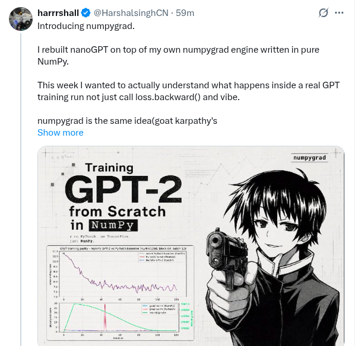

# GPT-2 from scratch in NumPy



A complete, **verified-correct** GPT-2 implementation in pure NumPy — autograd
engine, layers, model, optimizer and training loop — with no PyTorch, no JAX, no
autograd library in the model itself. PyTorch is used **only as a test oracle**:
every piece is checked against it, and the finished implementation, loaded with
real OpenAI GPT-2 124M weights, reproduces PyTorch's GPT-2 **to the decimal** on
WikiText-103 and LAMBADA.

The project was built in 9 steps, each gated by a parity test against PyTorch
(see [The verification suite](#the-verification-suite)). The math behind every
gradient is derived from first principles in [`derivation.md`](derivation.md).

---

## Results at a glance

| Model | Params | Context | WikiText-103 ppl | LAMBADA ppl | LAMBADA acc |
|---|---|---|---|---|---|
| Random baseline (uniform over vocab) | — | — | ~50,304 | ~50,304 | ~0% |
| our trained toy (100 steps, block 64) | 7.23M | 64 | 5331 | 102694 | 0.00% |
| **our NumPy impl + GPT-2 124M weights** | 124M | 1024 | **26.57** | **21.67** | **38.00%** |
| PyTorch GPT-2 124M *(same protocol)* | 124M | 1024 | 26.57 | 21.67 | 38.00% |
| GPT-2 124M (Radford et al. 2019, paper protocol) | 124M | 1024 | 37.50 | 35.13 | 45.99% |

The headline: **our from-scratch NumPy GPT-2 == PyTorch's GPT-2, number for
number** under the same evaluation protocol. The gap to the paper's 37.50 is
*evaluation protocol*, not the implementation. Full writeup:
[`tests/benchmark.md`](tests/benchmark.md).

---

## Repository layout

```
numpygrad/
├── README.md                 ← you are here
├── derivation.md             Step 0: every gradient derived from first principles (24 ops, 8 tiers)
│
│   ── the implementation (pure NumPy, no autograd library) ──
├── tensor.py                 the autograd engine: Tensor class, backward(), no_grad, op library
├── layers.py                 nn layers: Linear, LayerNorm, Embedding, MLP, MultiHeadAttention, TransformerBlock
├── gpt.py                    the full GPT-2: GPT, GPTConfig, load_state_dict
├── optimizer.py              AdamW (decoupled weight decay, bias correction)
├── trainer.py                training loop: train(), clip_grad_norm(), get_lr() cosine schedule
├── data.py                   OpenWebText .bin loader: load_split(), get_batch()
│
├── tests/                    the verification suite + benchmark + per-step results docs
│   ├── ops.py                Step 1: verified forward/backward closures — the math, in code
│   ├── gradcheck.py          Step 1: finite-difference gradient checks      → gradcheck_results.md
│   ├── test_tensor.py        Step 2: autograd primitives, bit-exact vs Step 1
│   ├── test_tensor_composites.py   Step 2: composed ops (sdpa / mha / block / tiny-gpt)
│   ├── test_layer_parity.py        Step 3: per-layer parity vs PyTorch       → layer_parity.md
│   ├── test_model_parity.py        Step 4: full-model parity vs nanoGPT      → model_parity.md
│   ├── test_optimizer_parity.py    Step 5: AdamW vs torch.optim.AdamW        → optimizer_parity.md
│   ├── test_train_step_parity.py   Step 6: one training step vs PyTorch      → train_step_parity.md
│   ├── test_overfit.py             Step 7: overfit-a-tiny-batch sanity check → overfit_results.md
│   ├── test_owt_parity.py          Step 8: real OWT training-curve parity    → owt_parity.md + .png
│   ├── benchmark.py                Step 9: WikiText-103 + LAMBADA (our impl) → benchmark.md
│   ├── benchmark_torch_ref.py      Step 9: PyTorch GPT-2 124M reference
│   └── *.md / owt_parity_loss.png  results docs, one per step
│
├── .venv/                    the Python environment (created by you — see Setup)
└── nanogpt/                  vendored nanoGPT — the PyTorch oracle, the data, the checkpoint
    ├── model.py              nanoGPT's GPT (PyTorch reference; from_pretrained loads GPT-2)
    ├── data/openwebtext/{train,val}.bin   tokenized OWT subset, 5.6M / 286K tokens (committed)
    ├── out-owt-baseline/ckpt.pt            the trained 100-step checkpoint = "our trained model"
    ├── out-owt-baseline/baseline_losses.json   the saved baseline loss curve
    ├── fixtures/parity_batch.pt            frozen (checkpoint + batch) for Steps 4 & 6
    └── config/train_owt_baseline.py        the baseline training config
```

Everything runs **CPU-only, float64**. Every script does its own `sys.path`
setup, so always run them from the repo root.

---

## Setup

Clone the repository, then create a virtual environment and install the
dependencies:

```bash
git clone https://github.com/harrrshall/numpygrad.git
cd numpygrad

python3 -m venv .venv
.venv/bin/pip install numpy scipy                 # the implementation itself
.venv/bin/pip install torch --index-url https://download.pytorch.org/whl/cpu  # test oracle
.venv/bin/pip install tiktoken datasets transformers matplotlib               # benchmark + plotting
```

What each dependency is for:

| Package | Used for | Needed by |
|---|---|---|
| `numpy` | the entire implementation | everything |
| `scipy` | `scipy.special.erf` — exact GeLU | `tensor.py`, `gpt.py` |
| `torch` | the **test oracle** + loading `.pt` checkpoints + `from_pretrained` GPT-2 | all `tests/*` parity scripts |
| `transformers` | downloading real GPT-2 124M weights | `benchmark.py`, `benchmark_torch_ref.py` |
| `datasets` | downloading WikiText-103 + LAMBADA | `benchmark.py`, `benchmark_torch_ref.py` |
| `tiktoken` | the GPT-2 BPE tokenizer | the benchmark scripts |
| `matplotlib` | the loss-curve plot | `test_owt_parity.py` |

The implementation itself (`tensor.py`, `layers.py`, `gpt.py`, `optimizer.py`,
`trainer.py`, `data.py`) needs only **`numpy` + `scipy`**. Everything else is for
verification and benchmarking.

Versions this was built/verified against: `numpy 2.4`, `torch 2.12.0+cpu`,
`scipy 1.17`, `tiktoken 0.12`, `datasets 4.8`, `transformers 5.8`,
`matplotlib 3.10`.

---

## Quick start

```bash
cd numpygrad

# 1. the autograd engine works (gradient-accumulation smoke test, ~6s)
.venv/bin/python tensor.py

# 2. every gradient formula is correct (finite-difference checks, ~2s)
.venv/bin/python tests/gradcheck.py

# 3. a layer matches PyTorch (per-layer parity, ~10s)
.venv/bin/python tests/test_layer_parity.py

# 4. the headline: real benchmark numbers (~10 min; downloads data + GPT-2 on first run)
.venv/bin/python tests/benchmark.py
```

---

## Running the benchmark

The benchmark evaluates two models on **WikiText-103** (perplexity) and
**LAMBADA** (perplexity + last-word accuracy), where

```
perplexity = exp(mean per-token cross-entropy)   on the held-out set.
```

### `tests/benchmark.py` — our NumPy implementation

```bash
.venv/bin/python tests/benchmark.py
```

What it does, in order:

1. **Downloads + tokenizes the datasets** (first run only — cached afterward in
   `~/.cache/huggingface/`):
   - WikiText-103 raw test (`Salesforce/wikitext`, config `wikitext-103-raw-v1`,
     `split="test"`) — joined with `\n\n`, tokenized with tiktoken GPT-2 BPE.
   - LAMBADA test (`EleutherAI/lambada_openai`, `split="test"`).
2. **Model 1 — the trained toy:** loads `nanogpt/out-owt-baseline/ckpt.pt`
   (the 7.23M-param, block-64, 100-step checkpoint) into `gpt.GPT` and evaluates
   it. Fast (~1 min).
3. **Model 2 — our impl + GPT-2 124M:** downloads real OpenAI GPT-2 124M weights
   (`transformers`, ~523 MB, first run only), loads them into `gpt.GPT`, and
   evaluates. This is the slow part — the 124M model is **~10.5 s per
   1024-token forward in NumPy on CPU** (~9 min for the WikiText subset).
4. **Writes [`tests/benchmark.md`](tests/benchmark.md)** — the eval table, the
   method, per-model detail, and the raw JSON results.

**Runtime:** ~10–14 min total on first run (the GPT-2 download adds a few
minutes; the toy model is ~1 min; GPT-2 124M in NumPy is ~9 min). It runs
forward-only under `tensor.no_grad()`, so no autograd graph is built.

**Subsets (for runtime):** WikiText-103 = first 18,000 tokens (17,999 scored);
LAMBADA = first 150 of 5,153 examples. Both subsets are representative; the
sizes are constants at the top of `benchmark.py` (`WIKITEXT_TOKENS`,
`LAMBADA_EXAMPLES`) — raise them for a tighter number, lower them for speed.

**Protocol:** WikiText-103 uses a strided sliding window (stride =
`block_size // 2`) — every token from index 1 on is scored exactly once, each
with up to `block_size // 2` tokens of left context (the Hugging Face
`perplexity` protocol). LAMBADA scores the final word's token(s) of each passage
given the rest; accuracy = the model's argmax matches every target token.

### `tests/benchmark_torch_ref.py` — the PyTorch reference

```bash
.venv/bin/python tests/benchmark_torch_ref.py
```

Runs **PyTorch's own GPT-2 124M** through the *identical* protocol, datasets and
subsets. It exists to prove the gap to the paper's number is *protocol*, not
implementation: it produces `WikiText-103 ppl 26.57, LAMBADA 21.67 / 38.00%` —
matching `benchmark.py`'s NumPy numbers to every reported digit. ~3 min (PyTorch
is much faster than NumPy here).

### Reading the result

`benchmark.md` is regenerated each run. The eval table places our numbers
against the published GPT-2 numbers (Radford et al. 2019). The toy model is, by
design, near-useless on these benchmarks (a 100-step / 64-context toy); the
meaningful row is **our impl + GPT-2 124M weights**, which equals the PyTorch
reference.

---

## Loading parameters (weights)

The model is `gpt.GPT`, configured with `gpt.GPTConfig`. Weights are loaded with
`GPT.load_state_dict(sd)`, where `sd` is a dict `{name: numpy_array}` in
**nanoGPT / PyTorch key format** — the loader does the translation for you.

### `GPTConfig` — the model shape

```python
import gpt
cfg = gpt.GPTConfig(
    vocab_size=50257,   # token vocabulary
    block_size=1024,    # max context length
    n_layer=12,         # number of transformer blocks
    n_head=12,          # attention heads per block
    n_embd=768,         # embedding / residual width
    bias=True,          # bias in Linear + LayerNorm (GPT-2: True; the toy: False)
    dropout=0.0,        # stored for fidelity; the implementation runs dropout-free
)
model = gpt.GPT(cfg)
```

### Option A — load the trained toy checkpoint

The 100-step model trained on the OpenWebText subset, saved at
`nanogpt/out-owt-baseline/ckpt.pt`:

```python
import sys; sys.path.insert(0, ".")        # repo root on the import path
import torch, gpt

ck = torch.load("nanogpt/out-owt-baseline/ckpt.pt", map_location="cpu", weights_only=False)
ma = ck["model_args"]                       # the config it was trained with
cfg = gpt.GPTConfig(vocab_size=ma["vocab_size"], block_size=ma["block_size"],
                    n_layer=ma["n_layer"], n_head=ma["n_head"],
                    n_embd=ma["n_embd"], bias=ma["bias"])
model = gpt.GPT(cfg)
model.load_state_dict({k: v.numpy() for k, v in ck["model"].items()})
```

### Option B — load real OpenAI GPT-2 124M

nanoGPT's `model.py` knows how to fetch the HF `gpt2` weights and transpose them
into Linear layout. Take its `state_dict` and load it into our `gpt.GPT`:

```python
import sys; sys.path.insert(0, "."); sys.path.insert(0, "nanogpt")
import gpt
from model import GPT as TorchGPT          # nanogpt/model.py

tg = TorchGPT.from_pretrained("gpt2")       # downloads ~523 MB once, then cached
sd = {k: v.detach().numpy() for k, v in tg.state_dict().items()}
del tg                                      # free the torch model

cfg = gpt.GPTConfig(vocab_size=50257, block_size=1024, n_layer=12,
                    n_head=12, n_embd=768, bias=True)
model = gpt.GPT(cfg)
model.load_state_dict(sd)                   # handles the key mapping + transposes
```

`gpt2-medium`, `gpt2-large`, `gpt2-xl` work the same way — just match the
`GPTConfig` to the chosen size (24/16/1024, 36/20/1280, 48/25/1600).

### What `load_state_dict` does internally

PyTorch / nanoGPT name parameters differently from this implementation, so the
loader (`gpt._torch_key_to_my`) translates each key:

| nanoGPT / PyTorch key | our parameter | transpose? |
|---|---|---|
| `transformer.wte.weight`, `transformer.wpe.weight` | `wte.weight`, `wpe.weight` | no |
| `transformer.h.{i}.ln_{1,2}.weight` / `.bias` | `h.{i}.ln_{1,2}.gamma` / `.beta` | no |
| `transformer.ln_f.weight` / `.bias` | `ln_f.gamma` / `.beta` | no |
| `...c_attn.weight`, `...c_proj.weight`, `...c_fc.weight` | `...c_attn.W`, `...c_proj.W`, `...c_fc.W` | **yes** |
| `...c_attn.bias`, `...c_proj.bias`, `...c_fc.bias` | `...c_attn.b`, `...c_proj.b`, `...c_fc.b` | no |
| `lm_head.weight` | *skipped* — weight-tied to `wte.weight` | — |

- **`transformer.` prefix** is stripped.
- **Linear weights are transposed.** This implementation stores a Linear weight
  as `(in, out)` and computes `x @ W + b`; PyTorch stores `(out, in)` and
  computes `x @ W.T + b`. The loader transposes so the math matches.
- **Weight tying is explicit.** There is no separate `lm_head` parameter — the
  output projection reuses `wte.weight` (one matrix, two uses; backprop
  accumulates both gradient contributions into it). `load_state_dict` *skips*
  `lm_head.weight` after asserting it equals `transformer.wte.weight`.
- **`*.attn.bias`** (the causal-mask buffer, not a parameter) is skipped.
- The loader raises if any model parameter is missing from the state_dict, or if
  a shape does not match — so a bad load fails loudly.

### Running a forward pass

`model(idx)` takes integer token ids of shape `(B, T)` (a NumPy array) and
returns `(logits, loss)`. With `targets=None` the loss is `None`; pass `targets`
of shape `(B, T)` to also get the mean cross-entropy.

```python
import numpy as np, tensor

ids = np.array([[15496, 11, 314, 716]])     # (B=1, T=4) token ids
with tensor.no_grad():                       # eval mode: no autograd graph built
    logits, _ = model(ids)                   # logits is a Tensor, shape (1, 4, vocab)
next_token_logits = logits.data[0, -1]       # .data is the NumPy array
```

Always wrap evaluation in `with tensor.no_grad():` — otherwise the forward
records the full autograd graph (slower, and a 124M-param graph is large).

### Greedy text generation (≈10 lines)

```python
import numpy as np, tensor, tiktoken
enc = tiktoken.get_encoding("gpt2")

def generate(model, prompt, n_new, block_size):
    ids = enc.encode_ordinary(prompt)
    for _ in range(n_new):
        ctx = np.array([ids[-block_size:]])
        with tensor.no_grad():
            logits, _ = model(ctx)
        ids.append(int(logits.data[0, -1].argmax()))   # greedy; sample for variety
    return enc.decode(ids)

print(generate(model, "The meaning of life is", 40, cfg.block_size))
```

(Use the GPT-2 124M weights from Option B for coherent output — the toy model
will produce noise.)

---

## Training

### The training loop — `trainer.train`

```python
import gpt, optimizer, trainer

cfg   = gpt.GPTConfig(vocab_size=50304, block_size=64, n_layer=4,
                      n_head=4, n_embd=128, bias=False)
model = gpt.GPT(cfg)

params   = model.parameters()                       # {name: Tensor}
no_decay = {n for n, p in params.items() if p.data.ndim < 2}   # nanoGPT: decay only >=2D
opt = optimizer.AdamW(params, lr=1e-3, betas=(0.9, 0.99), eps=1e-8,
                      weight_decay=0.1, no_decay=no_decay)

def get_batch(step):                                 # returns (x, y) int arrays, shape (B, T)
    ...                                              # e.g. data.get_batch(...)

losses = trainer.train(model, opt, get_batch, n_steps=1000,
                       grad_clip=1.0,
                       lr_schedule=lambda s: trainer.get_lr(s, 1e-3, 1e-4, 10, 1000),
                       log_every=50)
```

The loop is `zero_grad → forward → backward → clip_grad_norm → optimizer.step`.
The model and optimizer are built **once** and reused every step, so the
optimizer's moment state (`m`, `v`, `t`) persists — this is what makes it learn.
`clip_grad_norm` matches `torch.nn.utils.clip_grad_norm_`; `get_lr` is nanoGPT's
cosine-with-warmup schedule.

### Loading the OpenWebText data

`nanogpt/data/openwebtext/{train,val}.bin` are committed `uint16` token memmaps
(5.6M / 286K tokens). `data.py` reads them exactly as nanoGPT does:

```python
import data
train = data.load_split("train")                    # a numpy memmap
x, y  = data.get_batch(train, batch_size=12, block_size=64)   # (12, 64) int64 arrays
```

### Verify the loop learns — `test_overfit.py`

```bash
.venv/bin/python tests/test_overfit.py
```

Trains a small GPT on 16 fixed sequences for 500 steps; the loss must collapse
to near zero (it goes 4.84 → 0.001). A plateau would mean a broken loop. ~6 s.

### Match the PyTorch baseline — `test_owt_parity.py`

```bash
.venv/bin/python tests/test_owt_parity.py
```

Trains the NumPy GPT-2 and PyTorch in lockstep for 120 steps on the real OWT
subset — same seed, data, hyperparameters, LR schedule — and confirms the loss
curves agree to within ~0.006. Writes [`tests/owt_parity.md`](tests/owt_parity.md)
and `tests/owt_parity_loss.png`. ~6 min.

---

## The verification suite

The implementation was built in 9 steps, each gated by a parity test. Run any
script from the repo root with `.venv/bin/python <path>`:

| Step | Script | Checks | Output | Time |
|---|---|---|---|---|
| 1 | `tests/gradcheck.py` | every op's gradient vs finite differences | `gradcheck_results.md` | ~2 s |
| 2 | `tests/test_tensor.py` | autograd primitives, **bit-exact** vs Step 1 | (stdout) | ~3 s |
| 2 | `tests/test_tensor_composites.py` | composed ops (sdpa/mha/block/tiny-gpt) | (stdout) | ~2 s |
| 3 | `tests/test_layer_parity.py` | each layer vs PyTorch (fwd + bwd) | `layer_parity.md` | ~10 s |
| 4 | `tests/test_model_parity.py` | full GPT vs nanoGPT on the parity fixture | `model_parity.md` | ~5 s |
| 5 | `tests/test_optimizer_parity.py` | AdamW vs `torch.optim.AdamW`, 10 steps | `optimizer_parity.md` | ~2 s |
| 6 | `tests/test_train_step_parity.py` | one full training step vs PyTorch | `train_step_parity.md` | ~5 s |
| 7 | `tests/test_overfit.py` | the training loop overfits a tiny batch | `overfit_results.md` | ~6 s |
| 8 | `tests/test_owt_parity.py` | NumPy vs PyTorch training curve, 120 steps | `owt_parity.md` + `.png` | ~6 min |
| 9 | `tests/benchmark.py` | WikiText-103 + LAMBADA (toy + GPT-2 124M) | `benchmark.md` | ~10 min |
| 9 | `tests/benchmark_torch_ref.py` | PyTorch GPT-2 124M, same protocol | (stdout) | ~3 min |

`tensor.py` itself is runnable — `.venv/bin/python tensor.py` runs the
gradient-accumulation smoke test.

Run the fast checks (Steps 1–7) end to end — under a minute total:

```bash
for t in gradcheck test_tensor test_tensor_composites test_layer_parity \
         test_model_parity test_optimizer_parity test_train_step_parity test_overfit; do
  echo "=== $t ==="; .venv/bin/python tests/$t.py 2>&1 | tail -2
done
```

`step2_results.md` is a written summary of Step 2 (the `test_tensor*` scripts
print rather than write a doc). Every other `*.md` in `tests/` is regenerated by
its script.

---

## API reference

### `tensor.py` — the autograd engine

- **`Tensor(data, requires_grad=False)`** — wraps a float64 NumPy array. Records
  the op that produced it (`_parents`, `_backward`).
  - `.backward(grad=None)` — reverse-mode autodiff. With no argument, valid only
    on a scalar (seeds with 1). Walks the graph in reverse topological order.
  - `.zero_grad()` — clears `.grad` on this tensor and every ancestor.
  - `.data` (NumPy array), `.grad`, `.shape`; operators `+ - * @` and `.sum()`.
- **`no_grad()`** — context manager; ops inside build no graph (eval mode).
- **op library** (all return `Tensor`s, used by `layers.py`):
  `scale, relu, gelu, matmul, linear, sum_lastaxis, mean_lastaxis, transpose,
  permute_heads, reshape, slice_lastaxis, split3, softmax, cross_entropy,
  softmax_cross_entropy, layernorm, embedding, positional_embedding, lm_head,
  attention_scores, causal_mask, attention_output`. Each wraps a verified
  forward/backward closure from `tests/ops.py`.

### `layers.py` — neural-network layers

`Module` (base: `parameters()`, `zero_grad()`), `Linear`, `LayerNorm`,
`Embedding`, `MLP`, `MultiHeadAttention`, `TransformerBlock`. Each stores its
parameters as `Tensor`s, has a `__call__(x)` built from `tensor.py` ops, and
exposes `parameters() -> {name: Tensor}`.

### `gpt.py` — the full model

`GPTConfig`, `GPT` (`__call__(idx, targets=None) -> (logits, loss)`,
`parameters()`, `load_state_dict(sd)`), and `_torch_key_to_my(key)` (the key
translator). lm_head is weight-tied to `wte`.

### `optimizer.py` — `AdamW`

`AdamW(params, lr, betas, eps, weight_decay, no_decay)`. Decoupled weight decay
(`p *= 1 - lr*wd`, **not** folded into the gradient), moment EMAs, bias
correction. `.step()`, `.zero_grad()`. `no_decay` is a set of parameter names
that skip weight decay (nanoGPT excludes all 1-D tensors).

### `trainer.py` — the training loop

- `train(model, optimizer, get_batch, n_steps, grad_clip=None, lr_schedule=None, log_every=0)`
- `clip_grad_norm(params, max_norm)` — matches `torch.nn.utils.clip_grad_norm_`.
- `get_lr(it, learning_rate, min_lr, warmup_iters, lr_decay_iters)` — nanoGPT's
  cosine-with-warmup schedule.

### `data.py` — the data loader

- `load_split("train" | "val")` — memmaps `nanogpt/data/openwebtext/<split>.bin`.
- `get_batch(data, batch_size, block_size)` — one `(x, y)` batch, identical to
  nanoGPT's `get_batch` (consumes the same `torch.randint`).

---

## How it was built — design notes

The 9-step arc, each step verified before the next:

> `derivation.md` (the math) → `ops.py` + finite-difference checks → `tensor.py`
> autograd → `layers.py` → `gpt.py` → `optimizer.py` → `trainer.py` + `data.py`
> → training-curve parity → WikiText-103 / LAMBADA benchmark.

A few decisions worth knowing:

- **PyTorch is only an oracle.** It never appears in `tensor.py`, `layers.py`,
  `gpt.py`, `optimizer.py`, `trainer.py` or `data.py` — only in `tests/`.
- **Everything is float64.** The implementation runs in double precision; the
  parity tests run PyTorch in float64 too, so a mismatch is a real bug, not
  float32 noise.
- **GeLU is the exact `erf` form** (`x·Φ(x)`), matching `nanogpt/model.py`'s
  `nn.GELU()` — not the tanh approximation. See `derivation.md` item 4b.
- **`_backward` takes the gradient as an argument**, never closing over its own
  `Tensor` — otherwise `t ↔ t._backward` is a reference cycle and the autograd
  graph (≈700 MB/step for a 50k-vocab model) only frees on the cyclic GC, which
  OOMs a training run.
- **Gradient accumulation is the core correctness point.** A tensor used in *k*
  places receives *k* gradient contributions and they sum (`Tensor._accum`) —
  this is what makes residual connections and weight tying correct.
- Friction hit along the way is logged in
  [`nanogpt/roadblocks.md`](nanogpt/roadblocks.md).

---

## Notes & gotchas

- **Run from the repo root.** Scripts insert `.` and `nanogpt/` onto
  `sys.path`; `cd` elsewhere and imports break.
- **CPU-only, and the 124M model is slow in NumPy** (~10.5 s per 1024-token
  forward). The benchmark uses subsets for this reason — they are constants at
  the top of `benchmark.py`.
- **First benchmark run downloads** WikiText-103, LAMBADA, GPT-2 124M (~523 MB)
  and the tiktoken BPE — all cached afterward in `~/.cache/`.
- The `*.bin` data, the `ckpt.pt` checkpoint, and `parity_batch.pt` are
  committed under `nanogpt/` — no data preparation step is needed to run the
  parity tests or benchmark.
- `nanogpt/` is a vendored copy of nanoGPT, used as the reference. Its own
  `model.py` / `train.py` are unchanged from upstream except as noted in
  `nanogpt/roadblocks.md`.
